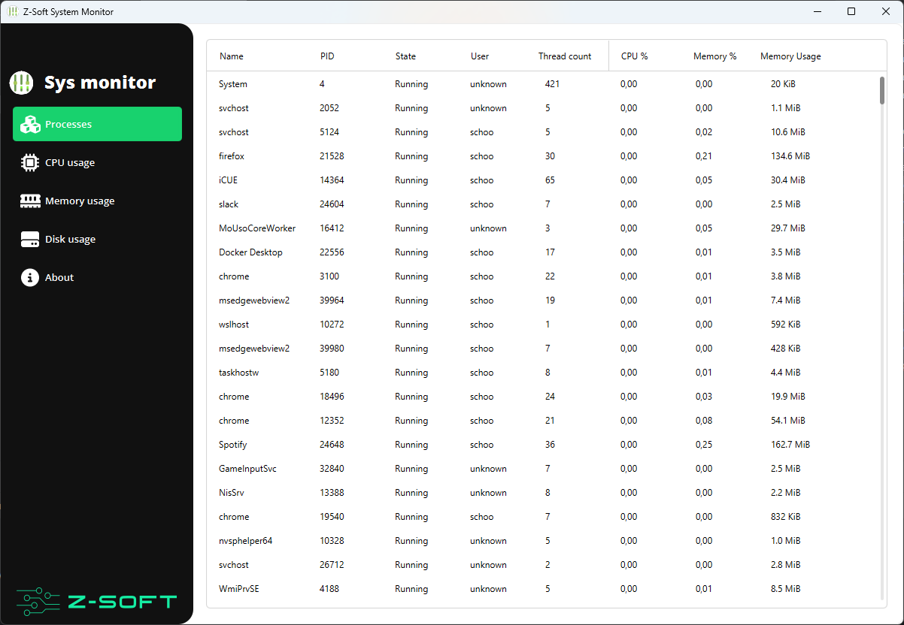

# Z-Soft universal system monitor

A system monitor build with Spring boot and JavaFX that works on Windows, MacOS and Linux.

## Features

- Processes list
- CPU Usage
- Memory usage
- Disk usage

## Screenshots

## Releases

You can check the releases page for the latest release.

For MacOS and Linux there is just a runnable JAR provided.

For windows there is a ZIP file with an exe file and a JRE environment.
Just extract the ZIP and run the exe.

## TODO

- [ ] Refactor UI tests so they run on CI/CD as well